# Chapter 1: Winter's End - The CSS Mess We're In

*Or: How we built a monster and learned to live with it*

> **"Learn concepts, not APIs."**
> 
> That's the CRISP difference. While other frameworks teach you their syntax—which changes with every major version—CRISP teaches you CSS. And CSS is forever.

## A Love Story Gone Wrong

CSS is wonderful and was never the underlying problem. Countless frameworks that tried to 'improve' CSS have evolved into true monstrosities over time. Whilst CSS itself became ever more powerful, we buried it under kilometre-thick layers of abstractions and raised a generation of developers who think only in frameworks, not in clean vanilla code.

Let's be honest about what we've done.

## The Modern CSS Reality Check

Open any production CSS file. Go on, I'll wait. What do you see?

```css
/* styles.css - 47,281 lines of pure anxiety */
/* Last meaningful comment: 2019 */
/* Authors: Everyone who ever worked here */
/* Methodologies: All of them, fighting for dominance */

.header { }                    /* The original sin */
.site-header { }              /* "We need to be more specific" */
.main-header { }              /* "No wait, this is the MAIN header" */
.primary-header { }           /* Dave's contribution, 2021 */
.header-wrapper { }           /* The wrapper era begins */
.header-container { }         /* "Wrapper was too informal" */
.header-container-inner { }   /* We've lost the plot */
.header-container-inner-wrap { } /* Send help */
```

And that's just for the header. We haven't even talked about the navigation yet.

## The Detours We've Taken

### Detour #1: The Great Class Name Arms Race

I have a question: Canst thou remember when class names were simple? Neither do I.

```html
<!-- Exhibit A: BEM goes wild -->
<div class="site-header__navigation-wrapper__list-container__item--active--mobile--collapsed">
  Home
</div>

<!-- Exhibit B: Atomic CSS has entered the chat -->
<div class="flex items-center justify-between p-4 md:p-6 lg:p-8 
            bg-white dark:bg-gray-900 border-b border-gray-200 
            dark:border-gray-700 shadow-sm hover:shadow-md 
            transition-all duration-300 relative z-10">
  Just a header, mate
</div>

<!-- Exhibit C: The "I've given up" approach -->
<div class="header-2023-v2-final-final-ACTUALLY-FINAL">
  Please work
</div>
```

### Detour #2: The Specificity Wars

Every CSS developer has been here:

```css
/* Monday */
.button { background: blue; }

/* Tuesday - "Why isn't it working?" */
.container .button { background: blue !important; }

/* Wednesday - "Still broken" */
body .container .button { background: blue !important; }

/* Thursday - Nuclear option */
body.page-template-default .main-content .container .button { 
  background: blue !important !important; /* yes, they tried */
}

/* Friday - The admission of defeat */
#specific-button-override { 
  background: blue !important; 
}

/* Two months later */
.button-blue-important-please-work {
  /* 47 lines of prayers disguised as CSS */
}
```

### Detour #3: The Framework Dependency Hellscape

Thy `package.json` doth tell a tale of desperation:

```json
{
  "dependencies": {
    "bootstrap": "^5.3.0",        // "We need a grid"
    "tailwindcss": "^3.4.0",      // "Bootstrap is too heavy"
    "styled-components": "^6.0.0", // "CSS-in-JS is the future"
    "emotion": "^11.0.0",         // "Actually, this CSS-in-JS"
    "sass": "^1.69.0",            // "We need nesting"
    "postcss": "^8.4.31",         // "We need... something?"
    "autoprefixer": "^10.4.16",   // "Browser support!"
    "purgecss": "^5.0.0",         // "Our CSS is 4MB help"
    "cssnano": "^6.0.1"           // "Make it smaller!"
  }
}
```

Build time: 3 minutes. CSS output: Still 2.3MB. Sanity: Not found.

```mermaid
graph TD
    PJ[package.json] --> B[Bootstrap<br/>for grids]
    PJ --> T[Tailwind<br/>for utilities]
    PJ --> SC[Styled Components<br/>for components]
    PJ --> S[Sass<br/>for nesting]
    PJ --> PC[PostCSS<br/>for... something?]
    
    B --> CSS[2.3MB CSS]
    T --> CSS
    SC --> CSS
    S --> CSS
    PC --> CSS
    
    CSS --> SAD[😢]
```



### Detour #4: The Utility Class Explosion

We solved CSS by... not writing CSS?

```html
<button class="px-4 py-2 bg-blue-500 hover:bg-blue-600 
               active:bg-blue-700 focus:outline-none focus:ring-2 
               focus:ring-blue-500 focus:ring-offset-2 
               disabled:opacity-50 disabled:cursor-not-allowed 
               text-white font-medium rounded-md shadow-sm 
               transition-colors duration-200 
               dark:bg-blue-600 dark:hover:bg-blue-700 
               sm:px-6 sm:py-3 sm:text-lg md:px-8 md:py-4 
               lg:text-xl xl:px-10 xl:py-5 2xl:text-2xl">
  Click me
</button>
```

Congratulations. Your HTML is now your CSS. You've invented inline styles with extra steps.

## The Numbers Don't Lie

Let's talk about what this madness costs:

- **Average CSS file size**: 250KB (gzipped) 
- **Number of classes**: 3,000+ unique classes
- **Unused CSS**: 67% (according to every audit ever)
- **Build complexity**: 12 build steps minimum
- **Developer sanity**: 404 Not Found
- **Time to add a button variant**: 45 minutes of archaeology

## The Modern CSS Features We're Ignoring

Here's the truly sad part. While we've been building our house of cards, CSS quietly became incredible:

### 🎯 Custom Properties (2017)
*Key powers: Runtime values, inheritance, calc() support, and JavaScript access*

```css
/* Native CSS variables with inheritance and runtime updates */
:root {
  --primary: blue;
  --spacing: 1rem;
}

.component {
  color: var(--primary);
  padding: var(--spacing);
}
```
**Modern browser support**: 100%  
**What we're still doing**: Using Sass variables that compile to static values

---

### 🏗️ CSS Grid (2017)
*Key powers: Named areas, auto-placement, fractional units, and true 2D layouts*

```
Desktop Layout:                    Mobile Layout (Same HTML DOM Structure !):
┌─────────────────────────────┐    ┌─────────────────┐
│          Header             │    │     Header      │
├─────────┬─────────┬─────────┤    ├─────────────────┤
│         │         │         │    │   Main Content  │ ← moved up!
│ Sidebar │  Main   │  Aside  │    ├─────────────────┤
│         │ Content │         │    │     Aside       │
│         │         │         │    ├─────────────────┤
├─────────┴─────────┴─────────┤    │    Sidebar      │ ← moved down!
│          Footer             │    ├─────────────────┤
└─────────────────────────────┘    │     Footer      │
                                   └─────────────────┘
```

```css
/* Two-dimensional layouts with named areas */
.app {
  display: grid;
  grid-template-areas:
    "header header header"
    "sidebar main aside"
    "footer footer footer";
  gap: 1rem;
}

/* Rearrange entire layout for mobile - NO DOM manipulation! */
@media (max-width: 768px) {
  .app {
    grid-template-areas:
      "header"
      "main"
      "aside"
      "sidebar"
      "footer";
  }
}

.header { grid-area: header; }
.main { grid-area: main; }
.sidebar { grid-area: sidebar; }
.aside { grid-area: aside; }
.footer { grid-area: footer; }
```

**Modern browser support**: 100%  
**What we're still doing**: JavaScript DOM manipulation for responsive layouts

---

### 🔒 @property (2021)
*Key powers: Type checking, animation control, inheritance rules, and syntax validation*

```css
/* Type-safe CSS with syntax checking */
@property --gradient-angle {
  syntax: "<angle>";
  inherits: false;
  initial-value: 0deg;
}
```
**Modern browser support**: 100%  
**What we're still doing**: Hoping our custom properties contain valid values

---

### 📚 @layer (2022)
*Key powers: Cascade control, specificity management, and framework isolation*

```css
/* Cascade layers end specificity wars forever */
@layer kernel, crisp, bridge, overrides;

/* This beats any framework specificity */
@layer overrides {
  .my-component { color: red; }
}
```

```
Layer Hierarchy (lowest to highest specificity):
┌────────────────────────────────────────────────────┐
│ kernel     - @property definitions (hidden)        │
├────────────────────────────────────────────────────┤
│ crisp      - Framework components & layouts        │
├────────────────────────────────────────────────────┤
│ bridge     - Togglable Vendor/framework sublayers  │
│   └── @layer bridge.tailwind {... import lib ...}  │
│   └── @layer bridge.bootstrap {... import lib ...} │
├────────────────────────────────────────────────────┤
│ overrides  - Your specific customisations          │
└────────────────────────────────────────────────────┘
              ↑ Specificity increases ↑
```
**Modern browser support**: 98%  
**What we're still doing**: `!important` everywhere

---

### 📦 Container Queries (2023)
*Key powers: Component-scoped breakpoints, inline-size queries, and style containment*

```css
/* Components that respond to their container, not viewport */
.card {
  container-type: inline-size;
}

@container (min-width: 400px) {
  .card { flex-direction: row; }
}
```
**Modern browser support**: 96%  
**What we're still doing**: Breakpoint classes for every viewport size

---

### 🎯 :has() Selector (2023)
*Key powers: Parent selection, conditional styling, and relationship-based logic*

```css
/* Parent selector - the holy grail */
.form:has(.input:invalid) {
  border-color: red;
}

/* Style based on children */
.nav:has(> .active) {
  background: highlight;
}
```
**Modern browser support**: 95%  
**What we're still doing**: JavaScript classList.toggle() madness

---

### 🎨 OKLCH Colors (2023)
*Key powers: Human readable and perceptual uniformity, predictable gradients, and accessible contrast*

```css
/* Perceptually uniform color space */
.brand {
  --primary: oklch(60% 0.15 250);
  --primary-dark: oklch(40% 0.15 250);  /* Actually darker! */
}
```
**Modern browser support**: 92%  
**What we're still doing**: Guessing with hex codes and HSL

---

### 📝 field-sizing (2024)
*Key powers: Auto-growing textareas, content-based sizing, and native behaviour, without any downwards compatibillity problems*

```css
/* Textareas that grow with content - no JS! */
textarea {
  field-sizing: content;
  min-height: 3em;
  max-height: 10em;
}
```
**Modern browser support**: Growing  
**What we're still doing**: 200 lines of JavaScript for auto-resize

We have superpowers but we're using kerfuffeled sticks and stones constructs to walk.

## The Human Cost

Beyond all technical debt, there's an important human cost:

- **New developer onboarding**: "Here's our CSS documentation" *points to 12 Confluence pages, 3 outdated READMEs, and yes, "just ask Sarah, she knows that part"*
- **Designer handoff**: "It's like the mockup but with... creative interpretations"
- **Performance reviews**: "Could you make the CSS more maintainable, please, could you?" *nervous laughter*
- **Team morale**: "I love everything about my job except the 47 npm packages we need to display a button"

## The Elephant in the Room

We know what's broken. Every developer survey confirms it:
- The CSS peripheral ecosystem is the most frustrating part of web development
- "CSS is broken" is a meme - but CSS isn't the problem, our tooling is
- We've accepted that suffering from framework churn is part of the job, and some irritated souls started loving and spreading it over the acres, so that everyone growing there never sees the underlying roots and their inherited power

But what if it didn't have to be this way?

## The Path Forward

What if I told you:
- You could write 90% less CSS
- Your specificity wars could end today
- You could use modern CSS features without studying in Oxford for 2 years
- Your HTML could be clean and semantic again
- A Dark mode could be some lines of colour properties away
- Your entire design system could be 10 base colours auto expanding up to hundereds

What if CSS could be... fun again?

You'd probably think I'd been at the sherry. But stay with me.

The winter of CSS complexity is ending. Spring is coming.

And it's called CRISP.

**The Killer Feature**: With CRISP, you learn concepts that stay forever – you learn to write pure CSS again. With other frameworks, you learn APIs that change with every major version. When Bootstrap 6 arrives, your Bootstrap 5 knowledge becomes technical debt. When Tailwind v4 ships, prepare to relearn everything. But CSS? CSS is eternal. And CRISP is just CSS, thoughtfully organised and a KISS of minimalism.

→ Continue to [Chapter 2: The 1+1+3 Formula](./CH02-solution.md)